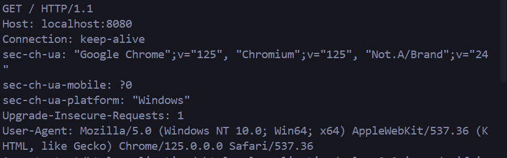

# HTTP Web Server

- Stores Processes and Delivers web pages to the users.
- Communication is done using Http


If we open any file in chrome or any other browser it will open and this is not a creation of a web browser this is just a reading and rendering of a file.
The text on the search bar begins with "File", which is good for simple websites, but this won't work on Server side Scripts, Databases, etc as they need http and web browser to process there requests.

## Initializing a Socket
Sockets are the endpoint in network communication system, they allow the data to be sent and receive over the network.
Enabling the connection between the client and the server they can handle multiple clients simultaneously.
```
Note - HTTP is data sent or received through the sockets.
```
### Address Family in Sockets
AdressFamily in socket refers to an IP (Internet Protocol - Rules for routing or sending packets over network between the devices)
When data travels over the Internet or web it travels in small packets, IP addresses ensures that devices like computer servers route those data packets to the correct place.

### Socket Types
- **SOCK_STREAM**:  TCP Socket (Transmission Control Protocol)
Establishes connection between the sender and the Receiver and ensures that the data once it arrives is complete in order and error free, this process is established usinf a handshake mechanism.

- **SOCK_DGRAM**: UDP Socket (User Datagram Protocol)
Sends datagram to the recipient without checking whether the recipient is ready to recieve the datagram or not.


### TCP Handshake
- **SYN**: Sequence number of data packets.
- **SYN-ACK**: Acknowledges the SYN packet and includes the server's sequence number.
- **ACK**: Acknowledges the server's SYN packet, initiating data exchange.

### TCP vs. UDP
Note - TCP ensures reliable transfer through error checking, retransmission when the packets are corrupted, and congestion control to reduce the network traffic load. Therefore it is uses where reliability and data integrity is more like web browsing and emails.
UDP doesn't establish a connection or handshake before sending data. The benefit is UDP is faster than TCP, therefore UDP is used in broadcasting services, online gaming, streaming, etc.

### DNS and Ports
- **DNS**: Maps domain names to IP addresses.
- **Common Ports**: 
  - HTTP: 80
  - HTTPS: 443
- **Reserved Ports**: Ports 0-1023 are reserved for OS use only.



## HTTP Request Structure
- 1st line is the request line /HTTP/1.1 it's usually the URL but it can be a path too.
- 1.1 is the HTTP version and the versions in HTTP depict the structure of the request.

1. **Version 0.9**
- Network layer: IP
- Transport layer: TCP
- Methods: GET

2. **Version 1.0**
- (add) Request Header
- (add) Version Field
- (add) Status Codes
- (add) Content-Type
- (add) Methods: POST, HEAD
```
Cache-Control, Pipelining, sending a second request before the first one is completed.
A new TCP was created for each HTTP call in previous versions, this is inefficient.
```
3. **Version 1.1** Connection can be reused.
- (add) Host Header
- (add) Persistent Connections
- (add) Continue Status
- (add) Methods: PUT, PATCH, DELETE, CONNECT, TRACE, OPTIONS.

4. **Version 2.0**
- (add) Request Multiplexing
- (add) Request Prioritizing
- (add) Automatic Compressing
- (add) Connection Reset
- (add) Server Push

5. **Version 3.0**
- (change) Transport Layer: QUIC
- **QUIC** - Quick UDP Internet connection - Built on top of UDP provided the reliability and ordering of TCP but with reduced latency and improved performance.
In this, the connection is identified using connection ids rather than connection IPs so switching from wifi to mobile data or any network won't have any effect.

```
Note - We are getting HTTP/1.1 because we have created a basic server created on TCP hence HTTP/3.0 is not used whic requires QUIC.
For HTTP/2.0 we need to have features like multiplexing which is handling Multiple requests at once.
```
- 2nd line Domain Name
- 3rd Connection keep alive - The client wants to keep the connections open rather than closing it right after this connection is fulfilled. The connection is reused.

- CORS - Cross Origin Resource Sharing - Security Mechanisms implemented by users to protect them from certains cyber attacks like Cross Site Request Forgery.

### CORS (Cross-Origin Resource Sharing)
Security mechanism to protect against cyber attacks like Cross-Site Request Forgery.

## Web Server Implementation


### GET Request Handling
Received the HTML page on a GET request:


### Unsupported Methods
Other methods are not allowed:


### Defining the Path
Setting up specific paths for handling requests:


---
## Any Contributions are welcome to make this browser better.
